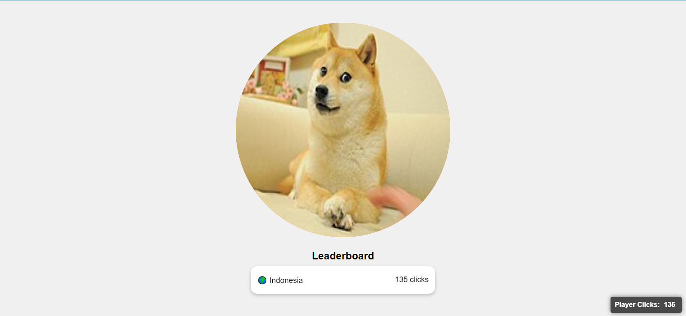

# Clicker Game Template

Welcome to the Clicker Game Template! This project is a free-to-use template for anyone interested in creating their own clicker game, similar to popular games like "Cookie Clicker" or "Cat Pop." Whether you're a seasoned developer or just getting started, this template will help you build your own fun and interactive clicker game.

## Features

- **Easy to Customize:** Modify the HTML, CSS, and JavaScript to create your unique game. The code is straightforward and well-organized for easy editing.
- **Cookie Management:** Built-in cookie consent and cookie handling for saving user progress. Players can continue where they left off!
- **Leaderboard:** Displays a leaderboard based on clicks, with support for location-based rankings.
- **Click Effects:** Includes animated click effects to enhance the user experience.
- **Responsive Design:** The template is designed to work on both desktop and mobile devices.

## Getting Started

### 1. Download the Latest Release

Download the latest version of the template from the [Releases](https://github.com/awiones/Clicker-Game-Template/releases) page on GitHub. No need for Git or any other tools—just download the ZIP file and extract it.

### 2. Open the Project

Once you've downloaded and extracted the ZIP file, open the project in your preferred code editor.

## Screenshots

  

### 3. Customize the Game

- **HTML (`index.html`)**: Modify the structure of the game, such as adding more buttons or changing the layout.
- **CSS (`styles.css`)**: Customize the look and feel of your game by editing the stylesheet.
- **JavaScript (`main.js`)**: Add new features or modify existing ones to enhance gameplay.

### 4. Host Your Game

Once you've customized the template, you can host your game on any web server or use free hosting platforms like GitHub Pages, Netlify, or Vercel.

## How to Use

1. **Click the Button:** Players click the button as fast as they can to earn points.
2. **Save Progress:** The game automatically saves the player's click count using cookies, so they can pick up where they left off.
3. **Leaderboard:** Players can compete with others by climbing the leaderboard, which shows rankings based on location and click count.

## Examples

This template can be used to create a variety of clicker games, such as:

- **Cookie Clicker Clone:** Replace the button with a cookie image and tally the total number of cookies baked.
- **Cat Pop:** Replace the button with a cat image and count how many times the cat pops up.
- **Custom Clicker Game:** Use your own graphics and theme to create a completely unique clicker game!
  
## Acknowledgments

- **Cookie Clicker**: Inspired by the classic cookie-clicking game.
- **Cat Pop**: A simple yet addictive clicker game that influenced this template.
  
## Contributing

Contributions are welcome! If you have suggestions, improvements, or bug fixes, please submit a pull request or open an issue.

- **Fork the Repository**: Create a personal copy of the repository on GitHub.
- **Make Changes**: Implement your changes and test them locally.
- **Submit a Pull Request**: Describe your changes and submit a pull request for review.

Feel free to use, modify, and build upon this project. If you make any improvements or modifications, please give credit to the original creator.

## License

This project is licensed under the MIT License. See the [LICENSE](LICENSE) file for details.

---

Made with ❤️ by Awiones

